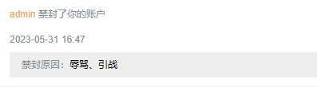
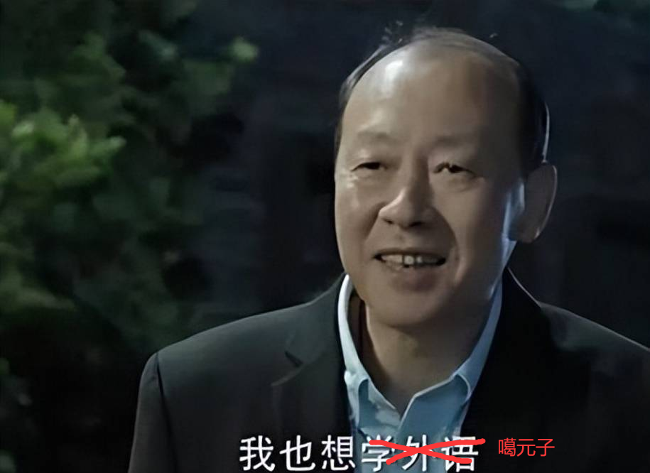

# KanXue-MrChen-melon
鹅城(kanxue)的百姓(members)不需要有青天大老爷，于是黄四郎(admin)就出手干掉了很多好县长。

不才请笨蛋ai生成了如下文章：客官慢慢看


# 从"营造人设"到"赚元子"

## ---获取高薪的关键特征

为了避免别人说，这篇帖子存在引流的嫌疑，咱所有的例子都源于看雪论坛、看雪学院。

## Intro

在当前的社交媒体时代，个人品牌和形象越来越受到重视。人们不仅需要拥有出色的工作能力和专业技能，还需要具备吸引人的个性魅力和营造良好的个人形象。营造一个好的人设对于噶元子、赚韭菜、赢得投资人信任以及获得更多商业机会都是非常重要的。


### 营造人设

#### 明确自己的核心价值观

首先，我们需要明确自己的核心价值观。这可以帮助我们确定自己的定位，并保持一致的行为准则。同时，也让别人更容易了解你的真实想法和信仰。

对此笔者觉得，可以选择对合适的开源项目进行二次开发，这样的话，小白萌新看到我们有开源精神，技术又好说话又好听，这都是具有绝对优势的。


#### 打造专业品牌

其次，我们需要打造自己的专业品牌。这包括创建一个个人网站、博客或社交媒体账号，并确保它们的内容高质量、富有创意和独特性。通过分享你的专业知识和思考，让别人更加了解你的专业背景和能力。


对此，笔者个人觉得，基于上一点，我们可以对gi\*\*\*ub自己二开的项目进行刷star（当然这样是不对的，但是为了赚元子我可以不要face），技术好的话，可以纯对自己的项目进行宣传，用的人多了得到大家的一致好评。如果有异议可以不认同。


#### 建立积极关系

最后，建立积极的人际关系网络非常重要。你需要与同行业的人建立联系，参加相关的社交活动和会议，了解业内新闻和趋势。同时，积极回应他人的问题并提供帮助，这样可以让你更受人信任。


对于这点来说，笔者觉得可以多多参与各种会议，比方说看雪峰会。与参会大佬们建立友好练习，向大佬们学习新知识。同时对于他人的问询也要积极相应做好帮助。


在营造好人设之后，就可以开始第二阶段的操作了。

## 噶元子

### 设计一份精彩的商业计划书

这里我要引用一下曾经的IOS版主肉丝姐的帖子 [从“flanker”到“逆向不看学历”、再到一无所有—— 获得高薪的关键特性](https://bbs.kanxue.com/thread-277273.htm)


我个人非常欣赏肉丝姐，这里要借鉴他帖子内的一些思想。

1. 学历（证书）
2. 名企（光环）
3. 比赛（得奖）
4. 项目(市场)
5. 演讲（顶会）
6. 文章(图书)

笔者这里没有说肉丝姐噶元子，各位看官不要乱想、乱引申、也不要乱给我扣帽子，不要喷我，喷我反手就是下图警告！



接着前文

1. ​	学历证书，陈老师告诉我们说：“首先是学历，这是毫无疑问的，大多是本硕都在985/211/双一流，具有绝对优势。”，我觉得这样说完全是没问题的并且我还想做出一些补充。单凭一个学历只能说是敲门的砖头，不能说是敲门的金砖。想要“金砖”就得花元子来认证！

   

   ​	既然如此，就可以利用自身影响力进行资格认证 。例如 [思科认证](https://baike.baidu.com/item/%E6%80%9D%E7%A7%91%E8%AE%A4%E8%AF%81/271599?fr=aladdin) 是由网络领域著名的厂商--*Cisco*公司推出的。是互联网领域的国际权威认证。也例如我们的肉丝姐的高级认证，在移动安全行业内已经得到了广泛认可(传说、真实性有待考证)。

   

   ​	在这里。笔者有意推出一个韭菜认证，给大家的简历上增加一个证书。目前只有韭菜认证·安卓，分为初级、中级、高级；具体考察内容还有待商榷。(这里不是打广告也不会打广告)

   

2. ​	名企，陈老师说得好：“如果你上一份工作就在名企，那跳槽、挪窝将变得轻而易举。现在名企之间反复横跳的情况也非常多见。能拿到高薪的Offer，大厂经历，或者至少大厂实习经历，也是很大的加分项。正所谓一日大厂、终身大厂。大厂选手再不起济也会选择外企养老，小公司待不惯，（可能会露馅（笑）。”

   

3. ​	比赛，陈老师说的好：“比赛一般是实际业务能力的试金石。”

   

4. ​	项目(市场)，陈老师说得好：“三百六十行，行行出状元。很多企业也会直接看项目，高star项目也可以检阅作者的代码水平和市场洞察能力。”这点和本文上述的`营造人设-打造专业品牌`有异曲同工之妙。不过我的手段卑劣了点，舍不得孩子套不着元子，只有花了元子，买了星(star)子、有了名(名气)子、出了课子、才能噶到心仪的元子。

   

5. ​	演讲，该说不说，陈老师说的真的很好：“咱普通人没那么高端，至少国内的一些会议、论坛、沙龙，议题该投投，演讲该蹭就蹭蹭，论文该发就发发，也是给自己丰富简历，跟业界同僚交流的好机会，能有论文发表到顶级期刊，还是有很大的说服力的。俗话说，会棍当得好，机会少不了。有更多的表现自己的机会还是要好好抓住，能跟大佬谈笑风生的人，也是大佬。”我举双手双脚认同！

   

6. ​	文章(图书)，由衷的感叹 陈老师说的是真的好：“写文章最出名的就是廖雪峰了，业界俗称”Python之父“。笔者也出了一些frida的文章和书，被人戏称为”frida布道师“，此外还有白龙的”Unidbg布道师“，还有非虫的eBPF等等，优秀的文章（精华文章）等可以让读者最直观、快速的了解到作者的技术水平，技术积累的深度和广度，以及研究的领域“ 。

   

   ​	如果自身实力不允许的情况下是可以找人代写书搞挂名（这只是本人可以想得到的操作，别人不要随便带入），和上面说的一样。花点元子很合适。当然这样是不对的，但是为了噶元子我可以不要face。

   


探讨结束，需要适当总结一下。


​	要舍得了孩子才能套得了元子。舍不得孩子套不着元子，只有花了元子，买了星(star)子、有了名(名气)子、出了课子、才能噶到心仪的元子。有了元子才能买车子、房子从而走向好日子。


​	由此观之！认证懂吧，这里里外外不少元子，但是你得有平台，没有平台是做不成事的。看雪就是一个好平台，为我们提供了氛围良好的学习平台、言论自由的平台。

开班！马上开班！




开培训班好啊，赚元子可老快了。<u>**头一年录视频，来年`改个年份`接着卖，保不齐第三年`改个年份`还能接着卖。这不就源源不断的元子就来了吗？**</u>（大家伙千万别乱想看雪是不会做这样的是的吧，对吧）

举个不恰当的例子 好比贴牌假酒 ，每年广告里当真酒卖的计划实施并不存在，都是无所谓的。看官看到这里可别乱想，看雪平台应该是会坚决打击这样的行为的。


### 寻找投资人


其次，你需要寻找合适的投资人。这包括参加各种创业交流会和路演活动，向潜在投资人展示你的创意和商业计划。


话不多说，我要开知识星球！有很多大师傅开的星球质量很高、比方说非虫大佬、葫芦娃大佬等。这些大佬活该赚元子，教的质量又高，更新又频繁，我直接学爆（这里都是肺腑之言）。教学质量低、更新不频繁，几年一更那就算了吧。虽然我可以不要face但是我还是想留点face。


赚钱嘛，不寒碜，总有小白想学技术。来微信问我不就好了，我转手就是星球二维码，这不元子分分钟到手吗？什么！没钱？白条总有吧。赚钱嘛，不寒碜。好好运营肯定不会被人骂，但是如果要是被很多人骂的话，可能就得思考一下，为什么嘞？该动手段动手段，先给人闭嘴再说后话。


不跑题了，回归正题


一定要寻找好的投资人，投资可能是货真价实的元子、也可以是货真价实的平台、有一个好的平台来提供给自己，有好的平台才能让自己更好的发光发热。这点我就要点名夸赞我们的看雪论坛、看雪学院。


看雪论坛、看雪学院不愧是安全界的黄埔军校、培养出了我们这么多优秀的会员，但是也有一些恶意会员，平日里引战、辱骂他人的我们光明正大的看雪也是会正义出拳的，不存在拉偏假、就算是有利益关系也不会明着帮，天子犯法还要与庶民同罪！


看雪这个平台给了我们这么好的平台。一定要好好使用并回报看雪这个大平台(多多出课与文章，出有意义的课与文章)。


### 维护好与投资人的关系


最后，当你找到了投资人之后，维护好与他们的关系就非常重要。定期向他们更新项目进展情况，并尽可能快速地响应他们的问题和需求。建立起良好的信任感和沟通渠道，有助于你获得更多的资金支持。


总之，营造一个好的人设对于圈钱是非常重要的。同时，一份精彩的商业计划书和良好的投资人关系也是不可或缺的。只有在这三个方面都做得很好，你才有可能赢得更多的商业机会和成功的投资。


## 感谢观看

上述文章都是由不聪明的gpt生成，本人添加润色而成。不针对任何一个人、也不针对任何一个团体，如果看官完我修正过的文章觉得有所启发，那么我的目的也达到了，如果没有启发请多多包含。文段里面没有攻击任何一个人，所以不要给我扣帽子。自己不要代号入座！再强调一遍！不要自己代号入座！没有攻击任何一个人！不要给我扣帽子。


感谢看雪给了我们每个人展示自我的平台。


请勿使用该文章内的一些内容进行**噶元子**的行为，这样是不齿的。如果不要face那就无所谓啦！


同步上传至[git](https://github.com/gajiucai-r0-MrCHEN/KanXue-MrChen-melon)项目。觉得不错的老哥可以star一下，这个star对我真的很重要！一个就可以帮我节约20块！谢谢！祝看雪越做越大！赚大大的元子！平台越做越好顺风顺水！


## 参考文献

1.  [从“flanker”到“逆向不看学历”、再到一无所有—— 获得高薪的关键特性](https://bbs.kanxue.com/thread-277273.htm)
2.  [让子弹飞](https://www.bilibili.com/bangumi/play/ss12548?theme=movie&spm_id_from=333.337.0.0)  节选1:18:38---1:19:22
3.  [看雪帖子277445](https://bbs.kanxue.com/thread-277445.htm)
4.  [看雪帖子277454](https://bbs.kanxue.com/thread-277454.htm)
5.  [看雪帖子知名道歉贴](https://bbs.kanxue.com/thread-277437.htm) 原先为卖书道歉贴，现已修正为封号道歉贴。

## 致谢

1. 看雪论坛、看雪学院
2. 肉丝陈老师
3. 姜文老师


## 获奖感言

```
“中国逆向现在什么水平，就这么几个人，你肉丝什么的都在搞培训，他能搞吗？搞不了！没这个能力知道吗？”
“再下去要输吾爱了，吾爱输完输飘云阁，再输学破解，接下来没人输了。”
RIP
对肉丝进行人身攻击的万剑归宗、はつゆき、黑洛、 如斯咩咩咩、重黎等被封号的人


手上还有Mr.CHEN大瓜，再跳的话你猜下一个爆的是啥 书?人设？元子？员工？
猜猜你身边多少人知道你的黑历史，而且有在往外说的


也希望看雪越做越好，元子多多的赚，但是别噶元子了。

多少人买了两万班三万班在私底下骂的？不知道吗？有多少视频是纯粹的水时长不清楚吗？
年年改名字，年年圈萌新。
一个ELF加载、读一个小时的书 有意思吗。

肉丝认证没有单位就不要了呗。
看到这里的观众老爷，如果有在想买2w、3w班课程的同学，请慎重考虑，没有说他不好，也没有说他有那么好。有需要就买为知识付费完全是没问题的。

这里笔者推荐 葫芦娃-知识星球、白龙-知识星球、非虫-知识星球、寒冰-脱壳 肉丝的就暂且先放一边把，后面要是他改好了咱就给他也推荐了。


```

